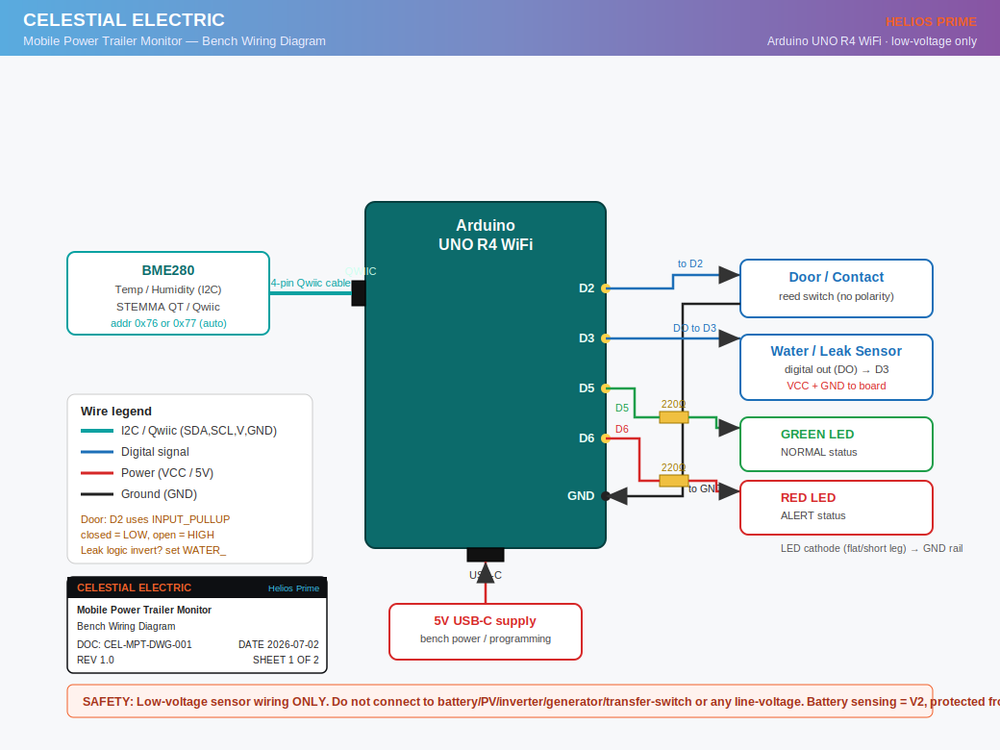
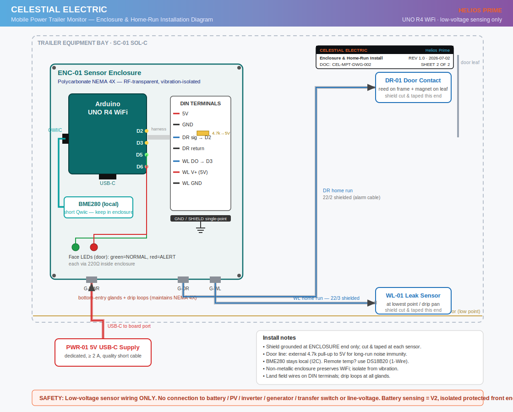

# Celestial Electric Mobile Power Trailer Monitor

Smart low-voltage monitoring for Celestial Electric's mobile power trailer:
temperature, humidity, water-leak, and door status on an **Arduino UNO R4 WiFi**,
published live to an **Arduino Cloud** dashboard — with field-hardened firmware
and a complete enclosure/home-run installation package.

**Doc family:** CEL-MPT &nbsp;|&nbsp; **Firmware:** REV 2.0 (`CEL-MPT-FW-002`) &nbsp;|&nbsp; Helios Prime

---

## What this system does

- Trailer interior **temperature + humidity** (BME280, I2C/Qwiic)
- **Water-leak detection** at the bay low point
- **Door/contact status** (magnetic reed)
- Local **normal/alert LED** indication + Serial telemetry
- **Arduino Cloud dashboard**: live gauges, state widgets, and a single
  roll-up `systemAlert`
- Resilient by design: local monitoring keeps running if WiFi/Cloud drops

Planned V2: battery bank voltage and EcoFlow visibility **behind a protected,
isolated sensing front end only** (see safety boundary).


## Wiring at a glance

| Bench (DWG-001) | Trailer install (DWG-002) |
| --- | --- |
|  |  |

## Repository layout

```text
arduino/
  celestial_mobile_power_trailer_monitor/         Bench test sketch (Serial only)
  celestial_mobile_power_trailer_monitor_cloud/   REV 2.0 Cloud sketch (field-hardened)
docs/
  trailer-monitoring-overview.md   System concept
  dashboard-fields.md              Cloud variable contract
  enclosure-install.md             Enclosure + home-run design decisions
  install-bom-addendum.md          Install hardware (adds to base BOM)
  safety-note.md                   Safety boundary
  bom.md / build-log.md
  assets/
    drawings/    Bench + enclosure wiring diagrams (SVG, doc-controlled)
    pdfs/        Branded packets incl. CEL-MPT-INS-001 install packet
    images/      Concept renders
hardware/
  pin-map.md          Pin assignments
  wiring-plan.md      Bench wiring
  pull-schedule.md    Field home-run pull/label schedule (DR-01, WL-01, PWR-01)
  test-checklist.md   Bench verification states
data/
  bom.csv                    Base bill of materials
  install_bom_addendum.csv   Enclosure/home-run additions
  pull_schedule.csv          Machine-readable pull schedule
tools/
  build_install_packet.py    Single-source generator: CSV + MD + branded PDF
```

## Quick start (bench)

1. Arduino IDE 2.x -> Boards Manager -> install **Arduino UNO R4 Boards**
2. Library Manager -> **Adafruit BME280 Library** (accept the Unified Sensor /
   BusIO dependencies)
3. Wire per `hardware/wiring-plan.md` (BME280 via the R4's Qwiic connector)
4. Upload `arduino/celestial_mobile_power_trailer_monitor/` and open Serial
   Monitor at **115200**
5. Walk the states in `hardware/test-checklist.md`

## Going live (Arduino Cloud)

1. Arduino Cloud -> **Devices -> Add device** (binds the R4's on-board ECC608
   crypto; do not hand-write auth)
2. Create a **Thing** with the five variables in `docs/dashboard-fields.md`
   (exact names/types)
3. Enter WiFi in the Thing's Network panel; Cloud generates `thingProperties.h`
4. Paste the logic from
   `arduino/celestial_mobile_power_trailer_monitor_cloud/` into the generated
   sketch (see that folder's README)
5. Build the dashboard: 2 gauges + 3 state widgets

Telemetry split: floats publish on a **30 s time policy** (trend + liveness
heartbeat); booleans publish **ON_CHANGE** (instant alerts).

## Firmware REV 2.0 highlights

- **Non-blocking loop** — `ArduinoCloud.update()` every pass; `millis()` cadence
  for sensing (no `delay()` starving the radio)
- **Confirm-N glitch filter** on door/leak inputs — EMI spikes on long home runs
  cannot false-trip an alert
- **BME280 auto-recovery** — NaN or dropped-sensor triggers non-blocking
  re-init; a jostled connector self-heals without reboot
- **Offline-first** — sensors + LEDs keep alerting locally with Cloud down
- Optional (commented): hardware watchdog, WiFi RSSI diagnostic

## Trailer installation

The full field package lives in
`docs/assets/pdfs/CEL-MPT-INS-001_install_packet.pdf` and
`docs/enclosure-install.md`. Key doctrine:

- **Non-metallic NEMA 4X enclosure** (metal = Faraday cage = dead WiFi)
- **22/4 shielded home runs**, shield grounded at the enclosure end **only**
- **External 4.7k pull-up** on the long door line
- **BME280 stays local** — I2C is not a long-run bus (remote temp = DS18B20)
- Dedicated **>= 2 A USB-C** supply via IP67 bulkhead; DIN terminals;
  bottom-entry glands with drip loops; vibration isolators

## Trailer power system notes

The trailer battery bank is two Duracell 12V lead-acid batteries rated
**810 CCA each**, wired in **parallel** — a **12V nominal** bank, not 24V. An
EcoFlow portable power system rides along as a separate source.

> CCA is a starting-current rating, not energy capacity. Runtime math needs the
> amp-hour or reserve-capacity rating from the battery labels.

## Safety boundary

**Low-voltage monitoring, training, and demonstration only.**

Do not connect an Arduino directly to service equipment, PV strings, battery
terminals, inverter terminals, generator controls, transfer switches, utility
equipment, fire alarm circuits, or line-voltage wiring. Any real field
installation must use listed equipment, isolation, fusing, overcurrent
protection, enclosures, strain relief, wire separation, and code-compliant
wiring methods. This project does not replace listed safety controls, BMS,
manufacturer monitoring, generator/ATS controls, fire alarm systems, or
code-required protective devices.

## Build phase

- [x] Concept documentation
- [x] Arduino Project Hub submission
- [x] Bench test sketch
- [x] Parts list
- [x] Cloud sketch (REV 2.0, field-hardened)
- [x] Enclosure + home-run install package (CEL-MPT-INS-001)
- [ ] Purchase parts
- [ ] Build bench prototype
- [ ] Install monitoring enclosure
- [ ] Commissioning check (incl. closed-lid RF test)
- [ ] Add real trailer photos
- [ ] Update Project Hub page after first field test

## Document control

| Doc | Title | Rev |
| --- | --- | --- |
| CEL-MPT-FW-002 | Cloud firmware (field-hardened) | 2.0 |
| CEL-MPT-DWG-001 | Bench wiring diagram | 1.0 |
| CEL-MPT-DWG-002 | Enclosure & home-run install diagram | 1.0 |
| CEL-MPT-INS-001 | Install packet (BOM addendum + pull schedule) | 1.0 |

## License

Apache License 2.0.
